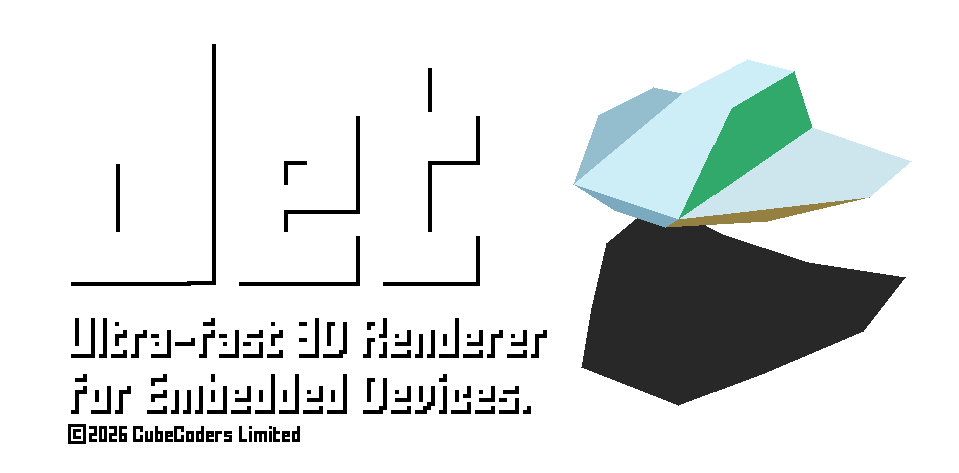

<p align="center">
  
</p>

# Jet

**Jet** is a tiny, dependency-free, fixed-function 3D rasteriser written in
modern C++17. It is designed to run on low-performance embedded hardware with limited memory such as the ESP32, STM32 and similar embedded MCUs, yet it is portable enough to run on a desktop PC, Raspberry Pi, or anything else.

Jet runs entirely in software using fast, integer-only arithmetic. It exclusively uses 16-bit RGB565 color natively for fast output to 565 displays such as the ST7796, ILI9488 and other similar SPI displays.

## Demo

A demonstration of a Wipeout-style game built on Jet, running on an
**ESP32-S3 at 60 FPS** (interlaced field-buffer mode, software-rendered, no
GPU):

[](https://www.youtube.com/watch?v=aKkb5L-YTTc "Jet on ESP32-S3 — 60 FPS Wipeout-style demo")

## What is it good at?

Jet is opinionated. Its sweet spot is:

- **Stylised / retro 3D** - flat-shaded, gouraud-shaded or affine-textured
  geometry, RGB565 framebuffers, the look of late-90s console / arcade 3D.
- **Hard real-time, fixed budget** - every feature is a compile-time switch in
  `Config.hpp`, so you only pay (in flash, RAM and CPU) for what you actually
  use. Disable Z-buffering, perspective-correct texturing or per-pixel
  lighting and the code for them simply isn't compiled in.
- **Tiny memory footprints** - fixed-point math throughout the hot path, an
  optional half-width framebuffer mode, optional interlaced field-buffer mode
  for 60 Hz on parts that can't sustain a full progressive frame, and an
  optional checkerboard reconstruction mode for desktop.
- **Predictable behaviour** - no allocations on the hot path, no virtual
  dispatch in the rasteriser, no hidden globals. The same scene renders the
  same way on every platform.

If you want PBR, real-time global illumination, mesh shaders or 4K then this is not the engine for you. If you want to put a smooth, lit, textured 3D scene
on a 320×240 LCD attached to a microcontroller, or to render a low-poly
software-rasterised aesthetic at silly framerates on a desktop, Jet is built
for exactly that.

## Feature highlights

Most of these are individually toggleable via `Config.hpp` (see
[`src/Config.example.hpp`](src/Config.example.hpp) for the full list and
documentation):

### Rendering
- Triangle and quad meshes with per-face material assignment.
- Flat, Gouraud, Phong and wireframe shading modes (per material).
- Affine and perspective-correct texture mapping; optional bilinear filtering.
- RGB565 colour throughout (16-bit framebuffer, native to most embedded
  displays).
- Optional Z-buffering, or painter's-algorithm sorting (per-object and/or
  per-triangle) when memory is tighter than CPU.
- Backface / frontface culling, depth bias for decals/shadows, per-object
  blend modes (replace, add, subtract, multiply, average, XOR).
- Screen-door alpha and noise-based dithering for cheap transparency.
- Per-object distance-based fade in / fade out (LOD pop reduction) and
  scene-wide depth fog.
- Interlaced or Checkerboard rendering (with optional reconstruction)

### Lighting
- Ambient + directional lights with FLAT / GOURAUD / PHONG shading.
- Optional `Z_BRIGHTNESS` cheap depth darkening for engines without a real
  light rig.

### Post-FX
- "Free" effects (no extra buffer): CRT scanlines, cell-shading.
- Buffered effects (desktop / large-RAM targets): FXAA, bloom, motion blur,
  chromatic aberration, pixelation.

### Tooling
- `Primitives::create*` helpers for cube / sphere / cylinder / capsule /
  pyramid / grid / plane / quad / billboard.
- Minimal Wavefront `.obj` loader.
- Optional screen-space picking (compile-time bounded; zero cost when set to
  0).
- A small custom shader entry point if you need to step outside the
  fixed-function path.

## Getting started

A standalone SDL3 desktop frontend lives in the parent repository under
`desktop/`. Build it from the repo root:

```powershell
cmake -S desktop -B build-desktop -DCMAKE_BUILD_TYPE=Release
cmake --build build-desktop --config Release --parallel
.\build-desktop\Release\jet32_desktop.exe
```

A separate companion repository hosts a growing set of standalone
example projects (HelloWorld and beyond) built on top of Jet. See the
project page for the latest link.

For ESP-IDF, depend on the component as you would any other:

```yaml
# main/idf_component.yml
dependencies:
  jet: "*"
```

…and provide a `Config.hpp` next to your application.

### Minimal example

Jet itself owns no window, no display driver and no main loop - it just
fills a framebuffer you give it. The host code below is the smallest
useful program: allocate a colour and depth buffer, build a scene with a
camera, a light and a cube, then call `scene->render()` once per frame.

```cpp
#include "Jet.hpp"
using namespace Renderer;

// 320x240 RGB565 colour buffer + matching Z-buffer.
constexpr int W = 320, H = 240;
uint16_t color[W * H];
uint16_t depth[ZBUFFER_STRIDE(W) * H];

int main() {
    Scene  scene(color, depth, W, H);
    scene.setBackcolor(0x0000);          // RGB565 clear colour (black)
    scene.setClearBuffer(true);

    Camera camera;
    camera.setPosition(0, 0, -500);      // world units
    camera.setFOV(75, W);
    camera.nearPlane = 16;
    camera.farPlane  = 8192;
    scene.setCamera(&camera);

    DirectionalLight sun(Vector3{45, 35, 0}, Color{255, 245, 220}, 220);
    AmbientLight     amb(Color{40, 48, 64});
    scene.setDirectionalLight(&sun);
    scene.setAmbientLight(&amb);

    Material red(0xF800);                // RGB565: bright red
    red.shadingMode = ShadingMode::GOURAUD;

    Object* cube = Primitives::createCube(200, 200, 200, &red);
    cube->setPosition(0, 0, 200);
    scene.addObject(cube);

    // Per-frame: rotate, render, push the buffer to your display.
    for (;;) {
        cube->rotate(0, 1, 0);           // 1 degree per frame around Y
        scene.render();                  // colour buffer now contains the frame
        // pushToDisplay(color, W, H);   // <-- you provide this
    }
}
```

There is no Jet-side `main()`, no platform glue, no event pump. Whatever
talks to your display (SPI, parallel RGB, DMA, SDL streaming texture,
fbdev, …) is yours to provide; Jet stops at the framebuffer.

## Documentation

Full API reference is generated from the inline Doxygen comments in
[`src/`](src) and is published via GitHub Pages at:

> **<https://cubecoders.github.io/Jet/>**

<!-- (GitHub Pages serves project sites at `https://<owner>.github.io/<repo>/`,
so the URL above is the canonical location for any commit on the
default branch once Pages is enabled in the repository settings.) -->

To build the docs locally (requires `doxygen` and optionally `graphviz`):

```powershell
cd components/Jet/src
doxygen Doxyfile
# output: components/Jet/src/docs/html/index.html
```

The repository is configured to publish the same Doxygen output to
GitHub Pages automatically on every push to the default branch - the
hosted version at the link above always matches the latest committed
sources.

## Licensing

Jet is dual-licensed.

### 1. Open-source: AGPL-3.0-or-later

Jet is distributed under the **GNU Affero General Public License version 3,
or (at your option) any later version**. The full text is in [`LICENSE`](LICENSE).

You are free to use, study, modify and redistribute Jet under the terms of
the AGPL. **In short: anyone you distribute a binary to (including users who
interact with it over a network) is entitled to the complete corresponding
source code of the application that links against Jet, under the AGPL.** This
is a feature, not a bug. It is what keeps Jet (and improvements to Jet) free
for everyone.

If you're hobbyist, an academic, an open-source project, or a company that
ships your source code anyway, you almost certainly want this licence and you
do not need to talk to us.

### 2. Commercial licence

If you want to ship a closed-source product that links against Jet - i.e. you
**cannot or do not wish to release the source of your application under the
AGPL** - a commercial licence is available from CubeCoders. The commercial
licence removes the AGPL's source-disclosure requirement for your product
while leaving the upstream Jet codebase itself unaffected.

> **Commercial licensing:** <https://cubecoders.com/jet>

We deliberately keep the open-source licence strong (AGPL, not LGPL or MIT)
precisely so that the commercial licence is meaningful. Revenue from
commercial licences is what funds continued development of the open-source
version; if you benefit commercially from Jet without releasing your source,
please buy a licence. It is the single most direct way to support the
project.

## Contributing

Contributions are welcome - bug reports, fixes, new platforms, new examples,
documentation improvements, all of it. Please open an issue or pull request
on the official repository.

Before your first contribution, please read [CONTRIBUTING.md](CONTRIBUTING.md).
Because Jet is dual-licensed (AGPL + commercial), every contributor must
agree to the Contributor Licence Agreement (CLA) documented there, which
explicitly authorises CubeCoders to relicense contributions under the
commercial Jet licence as well as the upstream AGPL version.

---

Jet is a [CubeCoders](https://cubecoders.com) project.
